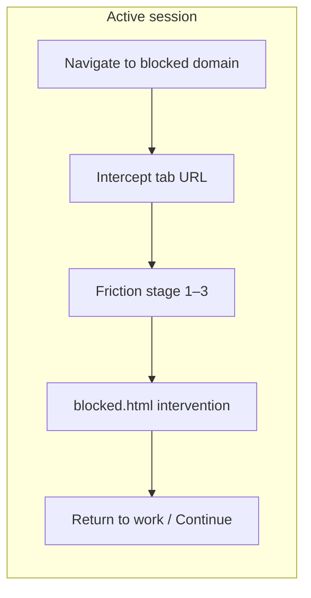

<div align="center">

# Focus Intent

**Task-aware focus sessions for Chrome — friction, not just blocks.**

A Manifest V3 extension that nudges you when you drift to distracting sites during a session. Escalating stages, a calm intervention page, and one-click return to real work. **Everything stays on your machine.**

[](https://developer.chrome.com/docs/extensions/mv3/intro/)
[](./LICENSE)
[](#privacy--permissions)

</div>

---

## Table of contents

- [Why this exists](#why-this-exists)
- [Features](#features)
- [How it works](#how-it-works)
- [Install](#install)
- [Usage](#usage)
- [Settings](#settings)
- [Privacy & permissions](#privacy--permissions)
- [Project structure](#project-structure)
- [Development](#development)
- [License](#license)

---

## Why this exists

Most “blockers” are binary: on or off, guilt or escape. **Focus Intent** assumes you are an adult choosing to work — it just makes distraction **cost a little attention** and keeps your **session intention** visible when you open a blocked domain.

- **Sessions** are tied to a task label and an end time (not a vague “focus mode”).
- **Friction escalates** across repeated visits in the same session (pause → stronger confirm → hard limit, or a **firm** shortcut).
- **Recovery** lets you jump back to your last productive tab instead of hunting through history.

No accounts, servers, or analytics. The intervention page states it plainly: nothing about that moment is sent to the cloud.

---

## Features

| | |
| --- | --- |
| **Session timer** | Start a focus session from the popup with a task name and duration; optional pause of intercepts. |
| **Domain list** | Configure which sites trigger the flow (options page + sensible defaults). |
| **Three friction stages** | First visit: short pause + choice. Later visits: checkbox acknowledgment and stricter paths (**Balanced** vs **Firm** presets in settings). |
| **Return to work** | Primary action always returns you to productive context; optional “open anyway” when the stage allows. |
| **Last work tab** | When available, recover the last non-blocked URL you had open during the session. |
| **Streaks** | Lightweight daily streak bookkeeping when sessions complete naturally (alarm-driven teardown). |
| **Local-first** | `chrome.storage.local` only; no network calls for core behavior. |

---

## How it works



1. With an **active session**, navigations are observed in the service worker (`tabs.onUpdated`).
2. If the hostname matches your **blocklist** (and the extension is enabled), the tab is redirected to **`blocked.html`** with query params: target URL, domain, friction **stage**, and `tabId`.
3. **`blocked.js`** loads session state from the background and renders the right controls for the stage (countdown, checkbox, timed unlock, etc.).
4. Messages (`shared/messaging-types.js`) coordinate **return to work**, **open target**, and **recovery** without exposing data off-device.

---

## Install

### From source (unpacked)

1. Clone the repository:

   ```bash
   git clone https://github.com/Le0wang06/focus-intent.git
   cd focus-intent
   ```

2. Open Chrome → **`chrome://extensions`**
3. Turn on **Developer mode**
4. Click **Load unpacked** and select the `focus-intent` folder

Updates: pull the latest `main` and click **Reload** on the extension card.

---

## Usage

1. Open the extension **popup** → enter what you are working on and how long → **Start session**.
2. Browse as usual. Opening a site on your blocklist during the session opens the **intervention** page instead of loading the site immediately.
3. Choose **Go back to work** (always available) or follow the stage-specific path if you still want to continue.
4. Use **Pause checks** in the popup if you need a short break from intercepts; **End session** when you are done.

Open **Options** (gear in the popup) to edit domains, friction style, and defaults.

---

## Settings

| Area | What you control |
| --- | --- |
| **Blocklist** | Domains that trigger the flow (normalized and deduplicated). |
| **Friction style** | **Balanced** (pause → confirm → hard limit) vs **Firm** (one light step, then strict). |
| **Defaults** | Starting duration, task placeholder, extension on/off. |

---

## Privacy & permissions

| Permission | Why |
| --- | --- |
| `storage` | Persist settings, session state, and streaks locally. |
| `tabs` | Read tab URLs for intercepts; redirect or return to productive tabs. |
| `alarms` | End sessions when the timer fires and update streak bookkeeping. |
| `http://*/*`, `https://*/*` | Match navigations against your blocklist and rewrite the tab to the local intervention page. |

There is **no** remote API, telemetry SDK, or sync layer in this codebase. Review `background/` and `shared/` if you want to trace every read/write.

---

## Project structure

| Path | Role |
| --- | --- |
| `manifest.json` | MV3 manifest, permissions, entry points |
| `background/main.js` | Service worker: listeners only |
| `background/handlers.js` | `runtime.onMessage` dispatch |
| `background/intercept.js` | URL checks, redirect to `blocked.html`, productive-tab tracking |
| `background/session.js` | Session lifecycle, expiry reconciliation |
| `background/storage.js` | `chrome.storage.local` + defaults |
| `background/friction.js` | Visit count → stage (1–3) |
| `background/streak.js` | Daily streak on natural session end |
| `popup.*` | Start/end session, timer, pause |
| `options.*` | Blocklist, presets, copy |
| `blocked.*` | Intervention UI + stage logic |
| `shared/` | Storage keys, messaging, domains, time, copy constants |
| `styles/tokens.css` | Shared design tokens and base controls |
| `icons/` | Toolbar / store icons |

**Stack:** Vanilla JavaScript (ES modules), no build step.

---

## Development

- Reload the extension after code changes (`chrome://extensions` → **Reload**).
- Use **Inspect views: service worker** on the extension card for background logs.
- Right-click the popup → **Inspect** for popup UI debugging.

---

## License

MIT © [Le0wang06](https://github.com/Le0wang06)
